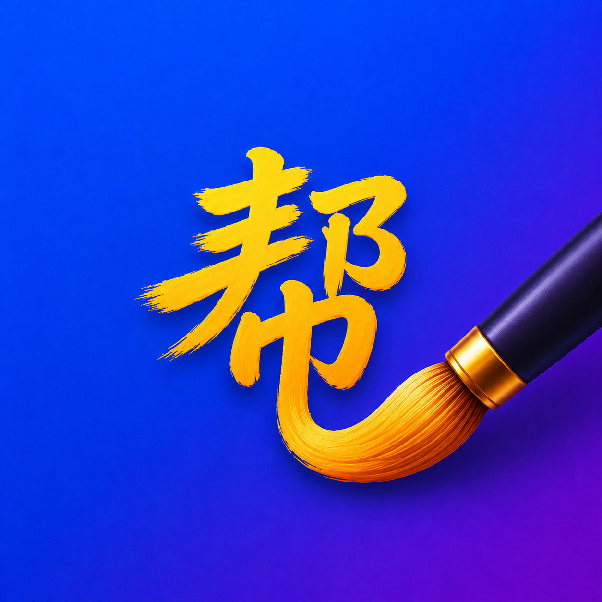

<div align="center">



# 帮你Draw

**Helps you draw.** A simple, fast sketching and painting app for Android
phones and tablets, made for the S Pen.

[](https://github.com/L-K-M/BangniDraw/actions/workflows/ci.yml)

Latest release: v<!-- version -->1.2.0<!-- /version --> · [Download](https://github.com/L-K-M/BangniDraw/releases/latest)

</div>

帮你Draw (Bāngnǐ Draw) is a layered raster drawing app that gets out of the
way: tap **+** and you are drawing, with pencils, pens, brushes that mix
color like real paint, erasers on the other end of the pen, smudge, fill,
layers, two-finger zoom-and-rotate, undo that survives closing the app, and
every painting kept up to date in your gallery. It runs from a phone (quick
sketches) to a large Samsung tablet (real paintings) and reshapes its UI
between them.

> [!IMPORTANT]
> **LLM disclosure:** this app is developed almost entirely by LLM agents,
> including its reviews. See [AGENTS.md](AGENTS.md) for the operational
> conventions and [PLAN.md](PLAN.md) for the design.

> [!NOTE]
> **Status:** v1. Automated gates pass; real-device acceptance remains
> unverified.

## Building

```sh
./gradlew assembleDebug        # or: scripts/build.sh --debug
scripts/install.sh             # build + install + launch on a device
```

Requirements: JDK 17, Android SDK (set `sdk.dir` in `local.properties` —
see `local.properties.example`). Both build types are signed with the
checked-in debug keystore so any clone produces installable,
upgrade-compatible APKs (a deliberate sideload-only decision — see
`docs/decisions/0005-zero-secret-signing.md`).

Paintings and undo history stay in app storage. Uninstalling removes them;
gallery copies remain.

## Releasing

`scripts/release.sh X.Y.Z --push` — never hand-edit `versionCode`, never
create a `v*` tag by hand. CI publishes the APK to GitHub Releases.

## License

[Unlicense](LICENSE) — public domain, for everything written here.

Natural color mixing is [Mixbox](https://github.com/scrtwpns/mixbox)
© 2022 Secret Weapons, licensed **CC BY-NC 4.0 — non-commercial use only**
(`third-party/mixbox/`). Because Mixbox ships inside the app, 帮你Draw as
distributed is non-commercial; the reasoning and the way out are recorded in
`docs/decisions/0003-mixbox-non-commercial.md`. Build without it with
`-Pbangnidraw.mixbox=false`.
